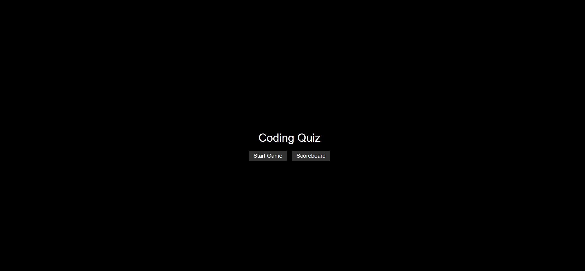

## Coding Timed Quiz
This website serves as a display of javascript capability. The website uses multiple functions such as timeIntervals to set the time for the quiz. The web application also deploys addEventlisteners and functions to clear display and run next line of code.
This website has 3 HTML pages that cycle through homepage >> index >> and scoreboard html files.
The webpage also includes 2 javascript files, one for the logic of the quiz and the other for the localstorage usage in the scoreboard.

## Screenshot(s) of Working Website:

Homepage:

QuizPage: 

Scoreboard:

## Link to Deployed Website:
https://chadedwardsofficial.github.io/coding-timed-quiz/index.html

## Credit:

All techniques used in this website are derived from SMU Coding Boot Camp, Online Internet Resources and reddit.

## Update:

Last Updated 10/2/2023